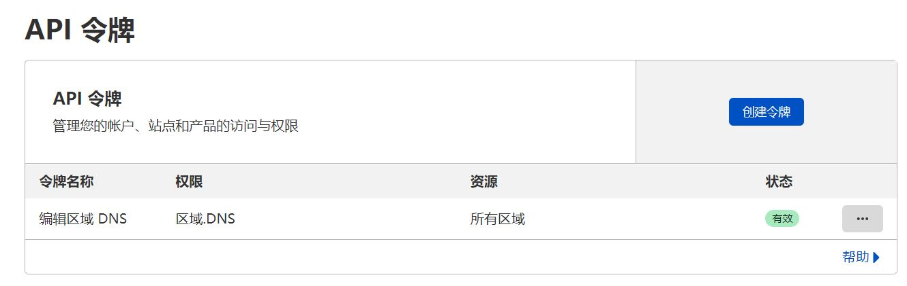
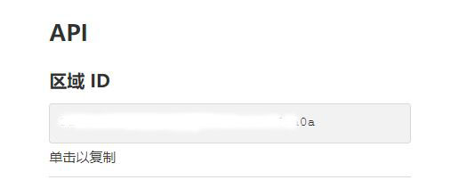

# go-cloudflare-ddns
A cloudflare ddns client by go  

这是一个由go编写的cloudflare 动态域名解析程序  

# 如何使用
1. 先在Cloudlfare添加一个API令牌，允许其编辑所有DNS区域，并记下API KEY(**只会显示一次**)  

  

2. 记下需要绑定域名的区域ID 

  

3. 下载对应操作系统和架构的客户端
4. 填写配置文件  
```bash
{"token":"填写你的API令牌的KEY","zeroid":"填写你的区域ID","name":"填写要绑定的域名名称","cron":"更新周期的Cron表达式","cn":true,"ipv6":false,"proxied":false}
```  

- token:填写第一步获取的API KEY
- zeroid:填写你的域名的区域ID
- name:填写你要绑定到的域名名称，如你的域名是example.com，要绑定到test.example.com，那么这里就填写test.example.com
- cron:填写检查IP更新周期的cron表达式，比如你要每30秒检查一次：*/30 * * * * ?
- cn:表示是否开启中国大陆加速，如果你的机器位于中国大陆，请填true
- ipv6:表示是否绑定本机公网IPV6，如果为false，则绑定本机公网IPV4
- proxied:表示否开启cloudlfare CDN  

5. 直接运行本程序带上配置文件的路径作为参数即可，若不带参数运行，第一次会在当前目录生成config.json作为默认配置文件
